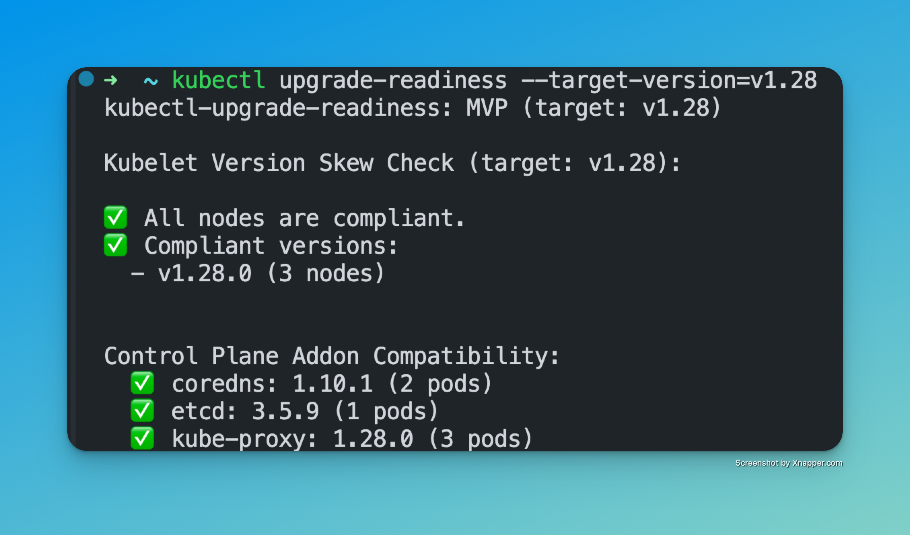
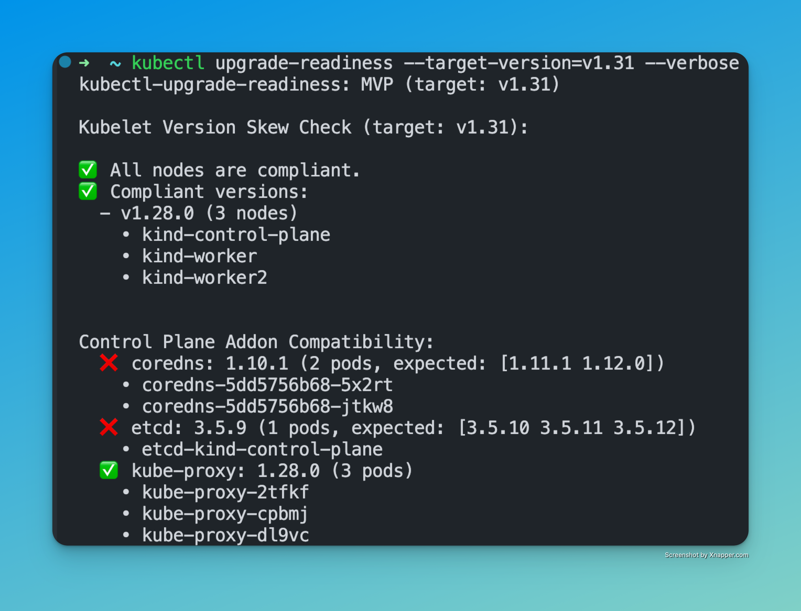

# kubectl-upgrade-readiness

A `kubectl` plugin to validate Kubernetes cluster upgrade readiness.  
It checks for critical preconditions like kubelet version uniformity and control plane addon compatibility — before you initiate a control plane upgrade.

---


---

## 🚀 Usage






```
 ~ kubectl upgrade-readiness --target-version=v1.28
kubectl-upgrade-readiness: MVP (target: v1.28)

Kubelet Version Skew Check (target: v1.28):

✅ All nodes are compliant.
✅ Compliant versions:
  - v1.28.0 (3 nodes)


Control Plane Addon Compatibility:
  ✅ coredns: 1.10.1 (2 pods)
  ✅ etcd: 3.5.9 (1 pods)
  ✅ kube-proxy: 1.28.0 (3 pods)
```

---

## ✨ Features

- Detects kubelet version skew across nodes
- Validates `kube-proxy`, `CoreDNS`, and `metrics-server` compatibility
- CLI-native output with actionable `[OK]` / `[!]` flags
- Designed for CI/CD and manual upgrade workflows

---

## 📦 Installation

```bash
go install github.com/marulkar/kubectl-upgrade_readiness@latest
````

After build, place the binary in your `$PATH`:

```bash
mv ~/go/bin/kubectl-upgrade_readiness /usr/local/bin/kubectl-upgrade-readiness
```

> ✅ Your plugin can now be used via `kubectl upgrade-readiness`.

---

## 🛡️ Permissions

Requires only read access:

* `get/list` on nodes and pods

---

## 🧭 Roadmap

* Krew packaging
* JSON output for CI pipelines

---

## 📄 License

[MIT](./LICENSE)
